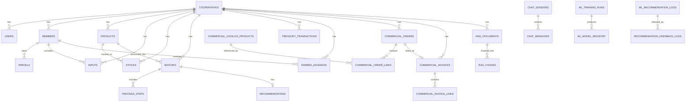
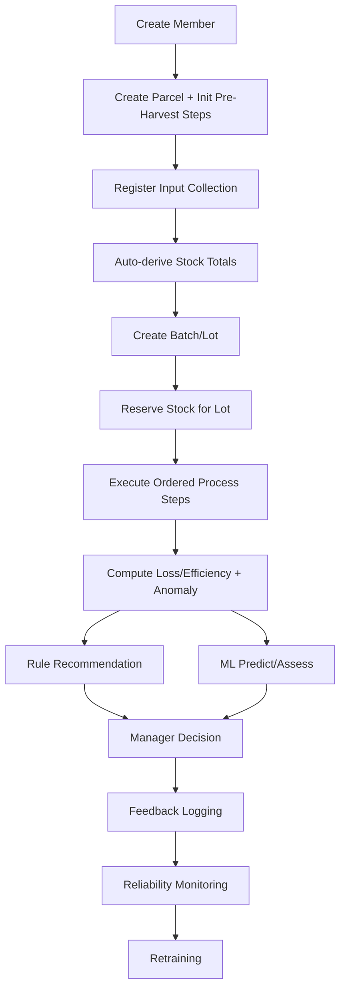
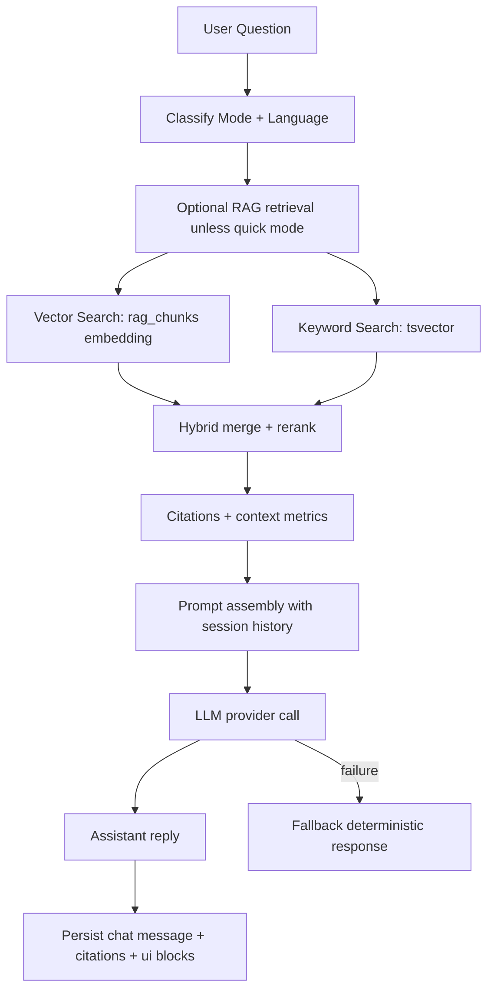

# WeeFarm - Evidence-Based Repository Audit for PFE Report

**Audit date:** 2026-05-05  
**Repository root:** `/Users/mohamedalibouzir/Desktop/Stage PFE/Pfe project`  
**Primary evidence base:** code, migrations, schemas, artifacts, tests, and runtime checks.  
**Secondary context used:** `docs/*.md` progress logs (treated as non-authoritative when conflicting with code).

---

## 1) Executive Project Context

### 1.1 Project identity
- **Project name:** WeeFarm
- **Project type:** Full-stack cooperative operations platform with AI/ML decision-support modules
- **Target users:** Cooperative admins, cooperative managers, operational teams (indirectly farmers/members via managed records)
- **Domain:** Agricultural cooperative operations and post-harvest transformation
- **Main business problem:** Fragmented cooperative workflows (member tracking, collection, stock/lots/process, treasury/commercial) and weak data-driven decision capability
- **Main technical objective:** Centralize operational workflows in a role-based platform with traceable data and actionable dashboards
- **Main AI objective:** Provide ML-assisted risk/loss assessment and RAG-assisted contextual guidance while keeping human-in-the-loop
- **MVP scope (implemented core):** auth, cooperative/user admin, members/parcels/pre-harvest, inputs/stocks/lots/process steps, analytics, treasury/farmer advances, commercial catalog/orders/invoices, ML endpoints, chat sessions
- **Out-of-scope / not mature:** autonomous optimization, validated production-grade impact recommender reliability, formal RAG benchmark suite
- **Current maturity level:**
  - Operational platform: **MVP (advanced)**
  - Predictive ML: **MVP / partially productionized**
  - Impact recommender: **prototype / not production-ready**
  - RAG assistant: **partial MVP (in development)**

### 1.2 Short version (<= 5 lines)
WeeFarm is a cooperative operations platform with AI-assisted decision support.  
It manages members, parcels, collections, stocks, lots, transformations, treasury, and commercialization.  
A FastAPI backend provides most business modules; a legacy Express backend still exists in parallel.  
ML prediction/assessment is implemented, but impact recommendation reliability targets are not met.  
RAG/LLM assistant exists and works in hybrid/fallback modes but remains under active enhancement.

### 1.3 Detailed version (2–3 paragraphs)
WeeFarm is structured as an operations backbone for agricultural cooperatives: user/cooperative administration, member and parcel tracking, collection intake, stock and lot lifecycle management, post-harvest process tracking, commercialization, invoicing, and treasury controls. The repository shows strong business-rule enforcement around quantity consistency, lot-step sequencing, stock reservation/release, and finance linkage (farmer advances and mirrored treasury transactions). The primary backend implementation is FastAPI with SQLAlchemy/Alembic, while a legacy Express/Prisma API is still present for compatibility.

On the AI side, the repository includes a complete classical ML workflow (feature engineering, training, artifacts, inference, logging, feedback, reliability endpoint) and an LLM assistant with RAG retrieval over cooperative data + reference knowledge. However, reliability evidence is mixed: predictive artifacts exist and tests pass, but the impact recommender report indicates `targets_met=false` with harmful/calibration indicators far from acceptable thresholds. The assistant supports grounded and fallback modes, but formal RAG evaluation harnesses are not integrated in backend test automation.

Therefore, the project is reportable as a technically substantial MVP with AI modules, but not as a fully validated AI-autonomous system.

### 1.4 Best positioning choice
**Best fit: (c) decision-support system**, secondarily **(e) full-stack management platform**.

Why:
- It is not only ERP-style CRUD: it includes risk/loss analytics logic, anomaly scoring, recommendations, and assistant retrieval.
- It is not only an AI platform/chatbot: most implemented value is operational transaction flow.
- The AI components currently advise humans rather than autonomously controlling operations.

**Code evidence:** `backend/app/services/analytics.py`, `backend/app/services/ml.py`, `backend/app/services/assistant.py`, `app/(platform)/manager/*`.

---

## 2) Functional Scope

### 2.1 Major modules inventory

| Module | Purpose | Main user actions | Frontend pages/components | Backend routes/services | DB tables | Status | Importance |
|---|---|---|---|---|---|---|---|
| Authentication | Login + identity resolution | Login, load profile, route by role | `components/auth/LoginExperience.tsx`, `context/auth/AuthContext.tsx` | `POST /auth/login`, `GET /auth/me` (`backend/app/api/routes/auth.py`) | `users`, `cooperatives` | Implemented (with backend mismatch on profile update) | High |
| Admin/cooperative management | Platform-level governance | Create cooperatives, create managers, list users/coops, disable users | `app/(platform)/admin/*` | `backend/app/api/routes/admin.py` | `cooperatives`, `users` | Partially implemented (no FastAPI enable/delete endpoints) | High |
| Members/Farmers | Cooperative member lifecycle | Create/update/delete/list members, list farmers and farmer parcels | `app/(platform)/manager/membres/page.tsx` | `members.py`, `farmers.py` | `members`, `fields`, `parcels`, `inputs` | Implemented | High |
| Parcels/fields/cultures | Parcel and pre-harvest structure | Create parcels, initialize/update pre-harvest steps, list by farmer | `app/(platform)/manager/parcelles/page.tsx` | `parcels.py`, `fields.py`, `services/parcels.py` | `parcels`, `pre_harvest_steps`, `fields` | Implemented | High |
| Collection/inputs | Intake from members | Create/update/delete inputs, filter lists | `app/(platform)/manager/inputs/page.tsx` | `inputs.py`, `services/inputs.py` | `inputs`, `stocks` (derived impact) | Implemented | High |
| Stocks | Inventory availability + alerts | View stocks, low stock alerts | `app/(platform)/manager/stocks/page.tsx` | `stocks.py`, `services/stocks.py` | `stocks` | Implemented with intentional restrictions | High |
| Batches/Lots | Transformation lot tracking | Create/update/delete lot, set status, preview lot code | `app/(platform)/manager/lots/page.tsx` | `batches.py`, `services/batches.py` | `batches`, `products`, `stocks` | Implemented | High |
| Process steps/post-harvest | Stage execution and constraints | Add/update/complete/delete latest step | `manager/lots` workspace components | `process_steps.py`, `services/process_steps.py` | `process_steps`, `batches` | Implemented | High |
| Analytics/dashboard | KPI, batch metrics, anomalies, deterministic recommendations | View dashboard, anomaly/recommendation per lot | `manager/dashboard`, `manager/lots?tab=analytics/recommendations` | `analytics.py`, `services/analytics.py` | `batches`, `process_steps`, `recommendations`, `stocks` | Implemented | High |
| Recommendations (rule + ML-assisted) | Suggest corrective actions | View recommendations from lot/dashboard + ML assess/predict flows | `manager/lots` tabs, `assistant-ia` context blocks | `analytics.py` + `ml.py` | `recommendations`, `ml_recommendation_logs`, `recommendation_feedback_logs` | Partially implemented (impact reliability weak) | High |
| ML training/prediction/assessment | Predictive + assessment flows | Train, predict, assess, health, reliability, feedback | Not a dedicated page; consumed indirectly and via API | `backend/app/api/routes/ml.py` | `ml_*` tables + artifacts | Partially production-ready | High |
| RAG/LLM assistant/chatbot | Contextual Q/A over ops + reference data | Chat sessions, ask questions, see citations, reindex RAG | `app/(platform)/manager/assistant-ia/page.tsx` | `chat.py`, `assistant.py`, `rag_indexer.py` | `chat_sessions`, `chat_messages`, `rag_documents`, `rag_chunks`, `reference_*` | Partial (under development) | High |
| Commercialization/orders/invoices | Selling flow and billing | Manage catalog, intake orders, status transitions, invoice views | `manager/commercialisation`, `manager/facturation` | `commercial.py`, `services/commercial.py` | `commercial_catalog_products`, `commercial_orders`, `commercial_order_lines`, `commercial_invoices`, `commercial_invoice_lines` | Implemented | High |
| Treasury/farmer advances | Financial control and cash tracking | Record treasury tx, create/cancel advances, stats | `manager/tresorerie`, `manager/avances-producteurs` | `treasury.py`, `farmer_advances.py` | `treasury_transactions`, `farmer_advances`, `global_charges` | Implemented | High |
| Feedback logging | Recommendation outcomes loop | Submit recommendation feedback/outcomes | API-level (not strongly surfaced UI-side) | `POST /ml/feedback` | `recommendation_feedback_logs` | Implemented but low real-data volume | Medium |
| Model monitoring/reliability | ML health gates | Health/reliability checks | API-level | `/ml/health`, `/ml/reliability` | `ml_training_runs`, artifacts, feedback logs | Implemented, targets not met | High |

### 2.2 Module status notes (critical)
- **Legacy redirect pages** exist and route old URLs to manager workspace (`app/(platform)/*/page.tsx` redirects).
- **Frontend-backend compatibility gaps:**
  - `AuthContext.updateProfile()` calls `PATCH /auth/me`, but FastAPI has no such endpoint.
  - Admin hooks call `/admin/users/{id}/enable` and `DELETE /admin/users/{id}`, FastAPI only has disable.
  - Product delete hook expects `DELETE /products/{id}`, FastAPI has no delete route.
- These gaps suggest either reliance on legacy Express API for some screens or unfinished FastAPI parity.

**Evidence:** `lib/api/endpoints.ts`, `hooks/useAdmin.ts`, `hooks/useProducts.ts`, `backend/app/api/routes/auth.py`, `backend/app/api/routes/admin.py`, `backend/app/api/routes/products.py`, `src/routes/auth.ts`, `src/routes/admin.ts`.

---

## 3) Technical Architecture

### 3.1 Textual architecture description
WeeFarm is a web platform with a Next.js frontend and two backend codebases in the same repository. The primary backend is FastAPI (`backend/app`) with SQLAlchemy ORM and Alembic migrations. A legacy Express + Prisma API (`src/`) remains for compatibility aliases and has overlapping endpoints.

Data storage is PostgreSQL-oriented (including pgvector for RAG), with fallback/default local SQLite config in FastAPI settings. RAG embeddings and LLM calls are externalized (OpenRouter/OpenAI/Groq/custom embedding endpoint). Operational and AI state are stored in relational tables plus model artifacts on filesystem (`backend/artifacts`).

Authentication is JWT bearer-based; role checks are enforced with dependency guards in FastAPI (`admin`, `manager`, cooperative read/write/delete roles). Deployment scaffolding includes Dockerfiles, docker-compose with pgvector image, startup migration hooks, and an Azure backend deployment script. Frontend Vercel linkage is present via `.vercel/project.json`.

### 3.2 Mermaid architecture diagram
```mermaid
flowchart LR
  U[Admin / Manager] --> FE[Next.js Frontend\napp/(platform)]
  FE -->|REST + JWT| API1[FastAPI Backend\nbackend/app]
  FE -->|Legacy-compatible REST| API2[Express Backend\nsrc/]

  API1 --> DB[(PostgreSQL / Supabase)]
  API2 --> DB

  API1 --> ART[(ML Artifacts\nbackend/artifacts/*.joblib,json)]
  API1 --> LLM[LLM Provider\nOpenRouter/Groq]
  API1 --> EMB[Embedding Provider\nOpenAI/OpenRouter/Custom]

  DB --> VEC[(pgvector\nrag_chunks.embedding)]
  API1 --> VEC
```

### 3.3 Layered architecture table

| Layer | Technology | Role | Evidence |
|---|---|---|---|
| Presentation | Next.js 15, React 19, TypeScript, Tailwind | Role-based UI, workflows, dashboards, chat UI | `package.json`, `app/(platform)/*`, `components/*` |
| Client state/data | React Query + custom API client | Fetch/mutate backend resources with JWT | `hooks/*.ts`, `lib/api/client.ts` |
| API (primary) | FastAPI + Pydantic + SQLAlchemy | Business APIs, rules, AI endpoints | `backend/app/main.py`, `backend/app/api/routes/*.py` |
| API (legacy) | Express 5 + Prisma | Legacy aliases and parallel route implementation | `src/app.ts`, `src/routes/*.ts` |
| Domain services | Python service layer | Stock/lot/process/analytics/ML/RAG logic | `backend/app/services/*.py`, `backend/app/ml/*` |
| Data persistence | PostgreSQL + Alembic | Operational + AI logs + RAG tables | `backend/alembic/versions/*.py`, `backend/app/models/*.py` |
| Vector retrieval | pgvector | Embedding storage and nearest-neighbor search | `backend/app/models/rag.py`, `3f4c2a1b9d7e_add_rag_pgvector_tables.py` |
| AI external providers | OpenRouter/OpenAI/Groq | LLM responses and embedding generation | `backend/app/core/config.py`, `services/rag_embeddings.py`, `ml/llm/provider.py` |
| Deployment/runtime | Docker, Azure script, Vercel linkage | Containerized backend, cloud deployment scaffolding | `backend/Dockerfile`, `docker/docker-compose.yml`, `scripts/deploy-backend-azure.sh`, `.vercel/project.json` |

---

## 4) Database and Data Model

### 4.1 Main entities and tenancy model
- **Tenancy root:** `cooperatives`.
- Most operational tables carry `cooperative_id` and are queried with manager scope.
- User roles gate visibility/actions (`admin`, `owner`, `manager`, `viewer`).

### 4.2 Entity groups
- **Operations:** members, fields, parcels, pre_harvest_steps, inputs, products, stocks, batches, process_steps, recommendations.
- **Finance/commercial:** treasury_transactions, farmer_advances, global_charges, commercial_* tables.
- **ML/observability:** ml_training_runs, ml_model_registry, ml_prediction_logs, ml_recommendation_logs, recommendation_feedback_logs.
- **RAG/reference/chat:** reference_metrics, knowledge_chunks, rag_documents, rag_chunks, chat_sessions, chat_messages.

### 4.3 Important tables (report-relevant)

| Table | Main fields (selected) | Purpose | Relationships | Used by | PFE relevance |
|---|---|---|---|---|---|
| `cooperatives` | `id,name,region,status` | tenant root | 1-N with users/members/products/... | all modules | Core multi-tenant boundary |
| `users` | `email,role,status,cooperative_id` | auth and authorization | N-1 cooperative | auth/admin | Security model |
| `members` | `code,full_name,main_product,cooperative_id` | farmer/member registry | N-1 cooperative; 1-N parcels/inputs/advances | member, parcel, input, finance | primary business actor |
| `parcels` | `member_id,name,surface_ha,main_culture` | land/culture unit | N-1 member; 1-N pre_harvest_steps | parcel/pre-harvest | pre-harvest tracking |
| `pre_harvest_steps` | `parcel_id,step_key,status,cost` | pre-harvest lifecycle | N-1 parcel/member | parcel analytics | upstream operations |
| `global_charges` | `member_id,parcel_id,amount_fcfa,treasury_transaction_id` | shared charges | linked to treasury | finance/pre-harvest | cost model |
| `inputs` | `member_id,product_id,quantity,status,date` | collection entries | affects stocks | collection/stocks | production intake |
| `products` | `name,unit,cooperative_id` | catalog of transformed products | linked to inputs/stocks/batches | products/stocks/lots | dimension entity |
| `stocks` | `total_stock_kg,reserved_in_lots_kg,processed_output_kg` | inventory state | N-1 product/cooperative | stocks/lots/commercial | critical control |
| `batches` | `product_id,initial_qty,current_qty,status` | lot-level processing | 1-N process_steps, 1-1 recommendation | lots | transformation backbone |
| `process_steps` | `batch_id,type,qty_in,qty_out,loss_value,status` | stage execution | N-1 batch | process/analytics/ML | quality and loss source |
| `recommendations` | `batch_id,loss_pct,risk_level,suggested_action` | deterministic recommendation cache | N-1 batch | analytics | decision-support evidence |
| `treasury_transactions` | `type,amount_fcfa,status,source_type,farmer_id` | finance ledger | optional link advances/charges | treasury/advances/commercial | financial traceability |
| `farmer_advances` | `farmer_id,amount_fcfa,status,treasury_transaction_id` | producer advance management | unique linked tx | farmer advances | cooperative cash flow |
| `commercial_catalog_products` | `source_product_id,total_stock_kg,reserved_stock_kg,status` | sellable catalog | linked order lines | commercial | market layer |
| `commercial_orders` + lines | `order_number,status,total_amount_fcfa` | order lifecycle | 1-N lines, 1-1 invoice | commercial | revenue operations |
| `commercial_invoices` + lines | `invoice_number,status,total_amount_fcfa` | billing and payment tracking | linked order | invoicing | financial closure |
| `ml_training_runs` | `run_name,dataset_rows,metrics` | training traceability | 1-N model registry | ML | reproducibility |
| `ml_model_registry` | `model_name,version,artifact_path,is_active` | model catalog | N-1 training run | ML | model governance |
| `ml_prediction_logs` | `predicted_loss_pct,risk_level,input_snapshot` | inference audit | optional batch link | ML | inference audit trail |
| `ml_recommendation_logs` | `structured_recommendation,llm_explanation` | recommendation archive | feedback relation | ML | explainability trail |
| `recommendation_feedback_logs` | `accepted,executed,delta_loss,outcome_label,is_holdout` | outcome/reliability loop | optional rec link | ML reliability | core for continuous learning |
| `reference_metrics` | `source_id,region,crop,metric,value` | external domain priors | none | reference/RAG context | domain knowledge |
| `knowledge_chunks` | `source_id,topic,content` | non-vector reference text | none | reference context retrieval | supplemental knowledge |
| `rag_documents` | `source_table,source_record_ref,content_hash` | indexed app-data docs | 1-N rag_chunks | RAG pipeline | freshness/index lifecycle |
| `rag_chunks` | `document_id,content,embedding vector(1536)` | vectorized chunks | N-1 rag_documents | RAG retrieval | semantic retrieval core |
| `chat_sessions/messages` | `session user scope, content, citations_json, mode` | assistant conversation memory | session-message | assistant UI/API | conversational traceability |

### 4.4 Simplified ERD (Mermaid)


### 4.5 Business data model explanation
The data model is transaction-first: real operations (inputs, lots, process steps, charges, orders, invoices, treasury) are first-class entities under cooperative scope. Analytics and ML are layered on top by reading these transactional tables and writing separate logs/artifacts/feedback for observability.

### 4.6 Data lifecycle (capture to analytics/AI)
1. Data is captured via operational APIs (members/parcels/inputs/lots/steps/finance).  
2. Derived stock/lot values are computed and constrained in service layer.  
3. Analytics compute KPI/anomaly/recommendation snapshots from live records.  
4. ML feature engineering builds frames from process history + stock context.  
5. Models produce predictions/assessments and log outputs.  
6. Feedback logs close the loop for reliability and future retraining.  
7. RAG indexer snapshots operational entities into vector documents/chunks for assistant grounding.

---

## 5) API Landscape

### 5.1 Route inventory totals
- **FastAPI routes found:** **111** (`backend/app/api/routes/*.py`)
- **Legacy Express routes found:** **87** (`src/routes/*.ts`)
- **Health endpoints:** `/health` in both backends

### 5.2 Auth and role patterns
- Public: `POST /auth/login`, `/health`
- Auth required: most routes
- Role restrictions:
  - Admin-only: `/admin/*`
  - Manager-only: most operational write/read routes
  - Cooperative read/write/delete split used in members/parcels/charges

**Evidence:** `backend/app/api/deps.py` + route dependencies in `backend/app/api/routes/*.py`.

### 5.3 API inventory grouped by domain (FastAPI)

> `Impl Status`: `I`=implemented, `P`=partial/risky, `M`=mock/fallback behavior in service, `U`=unclear.

#### Auth
| Method | Path | Purpose | Request body | Response | Auth | Role | Impl | Notes |
|---|---|---|---|---|---|---|---|---|
| POST | `/auth/login` | authenticate | `LoginRequest` | JWT token | No | Public | I | |
| GET | `/auth/me` | current user profile | - | user profile | Yes | any authenticated | I | frontend expects update route too (missing in FastAPI) |

#### Admin
| Method | Path | Purpose | Body | Response | Auth | Role | Impl | Notes |
|---|---|---|---|---|---|---|---|---|
| POST | `/admin/cooperatives` | create cooperative | `CooperativeCreate` | cooperative | Yes | admin | I | |
| POST | `/admin/managers` | create manager account | `ManagerCreate` | user | Yes | admin | I | |
| PATCH | `/admin/users/{user_id}/disable` | disable user | - | user | Yes | admin | I | |
| GET | `/admin/users` | list users | - | users[] | Yes | admin | I | |
| GET | `/admin/cooperatives` | list cooperatives | - | cooperatives[] | Yes | admin | I | |

#### Operations (members, farmers, parcels, fields, inputs, stocks, batches, steps)
| Method | Path |
|---|---|
| POST | `/members` |
| GET | `/members` |
| GET | `/members/{member_id}` |
| PATCH | `/members/{member_id}` |
| PUT | `/members/{member_id}` |
| DELETE | `/members/{member_id}` |
| POST | `/members/{member_id}/contact` |
| GET | `/farmers` |
| GET | `/farmers/{farmer_id}` |
| GET | `/farmers/{farmer_id}/parcels` |
| POST | `/fields` |
| GET | `/fields` |
| PATCH | `/fields/{field_id}` |
| GET | `/parcels` |
| POST | `/parcels` |
| PUT | `/parcels/{parcel_id}` |
| DELETE | `/parcels/{parcel_id}` |
| GET | `/parcels/{parcel_id}/pre-harvest` |
| GET | `/parcels/{parcel_id}/pre-harvest-steps` |
| POST | `/parcels/{parcel_id}/pre-harvest/init` |
| PUT | `/pre-harvest-events/{step_id}` |
| PUT | `/parcels/{parcel_id}/pre-harvest-steps/{step_id}` |
| POST | `/pre-harvest-events/{step_id}/complete` |
| POST | `/parcels/{parcel_id}/pre-harvest-steps/{step_id}/complete` |
| POST | `/inputs` |
| GET | `/inputs` |
| GET | `/inputs/{input_id}` |
| PATCH | `/inputs/{input_id}` |
| DELETE | `/inputs/{input_id}` |
| POST | `/products` |
| GET | `/products` |
| PATCH | `/products/{product_id}` |
| POST | `/stocks` |
| GET | `/stocks` |
| PATCH | `/stocks/{stock_id}` |
| POST | `/stocks/{stock_id}/increase` |
| POST | `/stocks/{stock_id}/decrease` |
| DELETE | `/stocks/{stock_id}` |
| GET | `/batches/reference-preview` |
| POST | `/batches` |
| GET | `/batches` |
| GET | `/batches/{batch_id}` |
| PATCH | `/batches/{batch_id}` |
| PATCH | `/batches/{batch_id}/status` |
| DELETE | `/batches/{batch_id}` |
| POST | `/process-steps` |
| GET | `/process-steps` |
| GET | `/process-steps/{step_id}` |
| PATCH | `/process-steps/{step_id}` |
| POST | `/process-steps/{step_id}/complete` |
| DELETE | `/process-steps/{step_id}` |

**Operations notes:**
- Many stock mutation endpoints exist but intentionally return validation errors (manual mutations disabled by design).
- Route-level implementation status for operations is mostly **implemented**.

#### Transformation / Analytics / Recommendations
| Method | Path | Purpose | Auth | Role | Impl |
|---|---|---|---|---|---|
| GET | `/analytics/dashboard` | manager KPI summary | Yes | manager | I |
| GET | `/analytics/batches/{batch_id}/metrics` | batch metrics | Yes | auth user (scoped) | I |
| GET | `/analytics/batches/{batch_id}/anomaly` | deterministic anomaly | Yes | auth user | I |
| GET | `/analytics/batches/{batch_id}/recommendation` | deterministic recommendation refresh | Yes | auth user | I |
| GET | `/analytics/pre-harvest/summary` | pre-harvest summary | Yes | cooperative user | I |
| GET | `/analytics/pre-harvest/costs-by-farmer` | cost breakdown | Yes | cooperative user | I |
| GET | `/analytics/pre-harvest/costs-by-parcel` | cost breakdown | Yes | cooperative user | I |
| GET | `/analytics/pre-harvest/costs-by-crop` | cost breakdown | Yes | cooperative user | I |
| GET | `/analytics/pre-harvest/costs-by-hectare` | cost/ha breakdown | Yes | cooperative user | I |

#### ML
| Method | Path | Purpose | Body | Response | Auth | Role | Impl | Notes |
|---|---|---|---|---|---|---|---|---|
| POST | `/ml/train` | train models | `MLTrainRequest` | run + metrics | Yes | manager | I | needs min rows |
| POST | `/ml/predict` | predictive inference | `MLPredictRequest` | prediction + recommendation | Yes | manager | I | optional LLM explanation |
| POST | `/ml/assess` | assessment inference | `MLAssessRequest` | assessment + recommendation | Yes | manager | I | |
| GET | `/ml/health` | artifact/model status | - | readiness snapshot | Yes | manager | I | |
| GET | `/ml/features/{batch_id}` | engineered features | - | feature rows | Yes | manager | I | |
| GET | `/ml/recommendation/{batch_id}` | assess+recommendation | - | recommendation payload | Yes | manager | I | |
| POST | `/ml/feedback` | log outcomes | `RecommendationFeedbackCreate` | saved feedback | Yes | manager | I | low real feedback |
| GET | `/ml/reliability` | reliability metrics | - | targets/status | Yes | manager | I | currently not meeting targets |

#### RAG / LLM / Chat
| Method | Path | Purpose | Auth | Role | Impl | Notes |
|---|---|---|---|---|---|---|
| POST | `/chat` | message to assistant | Yes | auth user | I | llm-rag/llm/fallback modes |
| GET | `/chat/sessions` | list sessions | Yes | auth user | I | |
| POST | `/chat/sessions` | create session | Yes | auth user | I | |
| GET | `/chat/sessions/{session_id}/messages` | list messages | Yes | auth user | I | |
| POST | `/chat/sessions/{session_id}/messages` | send in session | Yes | auth user | I | |
| POST | `/chat/rag/reindex` | rebuild RAG index | Yes | manager/admin-scoped | I | pgvector + embedding dependency |
| GET | `/reference/metrics` | reference metrics lookup | Yes | auth user | I | seed-based reference layer |
| GET | `/reference/knowledge` | knowledge chunk lookup | Yes | auth user | I | |

#### Finance
| Method | Path | Purpose | Impl |
|---|---|---|---|
| GET | `/treasury` | list transactions | I |
| POST | `/treasury` | create manual transaction | I |
| PUT | `/treasury/{transaction_id}` | update manual transaction | I |
| PATCH | `/treasury/{transaction_id}/cancel` | cancel manual transaction | I |
| GET | `/treasury/stats` | treasury KPIs | I |
| GET | `/farmer-advances/summary` | summary by farmer | I |
| GET | `/farmer-advances/farmer/{farmer_id}` | detail by farmer | I |
| POST | `/farmer-advances` | create advance | I |
| PUT | `/farmer-advances/{advance_id}` | update advance | I |
| PATCH | `/farmer-advances/{advance_id}/cancel` | cancel advance | I |
| GET | `/charges` | list global charges | I |
| POST | `/charges` | create charge + treasury mirror | I |
| PUT | `/charges/{charge_id}` | update charge + mirror | I |
| DELETE | `/charges/{charge_id}` | delete charge | I |
| GET | `/farmers/{farmer_id}/global-charges` | farmer charges | I |
| POST | `/global-charges` | alias create charge | I |

#### Commercial
| Method | Path | Purpose | Impl |
|---|---|---|---|
| GET | `/commercial/catalog` | list sellable products | I |
| POST | `/commercial/catalog` | create catalog product + allocate stock | I |
| PATCH | `/commercial/catalog/{catalog_product_id}` | update catalog item | I |
| PATCH | `/commercial/catalog/{catalog_product_id}/status` | activate/hide | I |
| DELETE | `/commercial/catalog/{catalog_product_id}` | delete/release stock | I |
| GET | `/commercial/orders` | list orders | I |
| GET | `/commercial/orders/stats` | order stats | I |
| POST | `/commercial/orders` | intake order | I |
| PATCH | `/commercial/orders/{order_id}/status` | lifecycle transition | I |
| GET | `/commercial/invoices` | list invoices | I |
| GET | `/commercial/invoices/stats` | invoice stats | I |
| GET | `/commercial/invoices/{invoice_id}` | invoice detail | I |

#### Health/monitoring
| Method | Path | Purpose | Impl |
|---|---|---|---|
| GET | `/health` | service health | I |
| GET | `/ml/health` | ML artifact health | I |
| GET | `/ml/reliability` | recommendation reliability status | I |

### 5.4 Most important endpoints for report
1. `/analytics/dashboard`  
2. `/batches`, `/process-steps`, `/stocks`  
3. `/ml/predict`, `/ml/assess`, `/ml/reliability`  
4. `/chat`, `/chat/rag/reindex`  
5. `/commercial/orders`, `/commercial/invoices`  
6. `/treasury/*`, `/farmer-advances/*`

### 5.5 Endpoints incomplete/risky/fallback
- **Parity gaps in FastAPI vs frontend hooks:** `/auth/me` PATCH, `/admin/users/{id}/enable`, `/admin/users/{id}` DELETE, `/products/{id}` DELETE.
- **Intentional hard-stop endpoints:** stock create/update/increase/decrease/delete return business validation errors (manual stock mutations disabled).
- **RAG route risk:** `/chat/rag/reindex` depends on pgvector + embedding provider config.
- **ML reliability route currently indicates not-ready impact recommender.

---

## 6) Frontend Structure and UX

### 6.1 Main frontend routes/pages
- Public/login: `app/page.tsx`, `components/auth/LoginExperience.tsx`
- Admin: `/admin/dashboard`, `/admin/cooperatives`, `/admin/managers`, `/admin/parametres`
- Manager: `/manager/dashboard`, `/manager/membres`, `/manager/parcelles`, `/manager/inputs`, `/manager/stocks`, `/manager/lots`, `/manager/commercialisation`, `/manager/facturation`, `/manager/tresorerie`, `/manager/avances-producteurs`, `/manager/assistant-ia`, `/manager/produits`, `/manager/parametres`
- Legacy redirects: many top-level routes redirect to manager pages.

### 6.2 Dashboard structure
- KPI cards, trend charts, loss/efficiency visualizations, recent operations table, stock alerts.
- Data source: `/analytics/dashboard` plus supporting members/products/stocks hooks.

### 6.3 Data entry workflows
- Members -> Parcels/Pre-harvest -> Inputs -> Lots/Steps -> Commercial/Invoice -> Treasury/Advances.
- Forms include local validation and error messages; many pages include explicit empty/error states.

### 6.4 Chatbot/RAG interface
- Session list + message timeline + composer.
- Displays assistant metrics/citations/ui blocks when available.
- Error fallback message shown when assistant/LLM fails.

### 6.5 Recommendation interface
- Integrated mainly in lots workspace tabs (`process`, `analytics`, `recommendations`, `history`) rather than a dedicated standalone mature module.

### 6.6 Design system/theme
- Custom visual style; not a formal component library with strict token governance (not confirmed as design-system product).

### 6.7 User roles and navigation logic
- `ProtectedRoute` enforces role-based redirection (`admin` to admin shell, others to manager shell).
- Sidebar nav differs by role in `AppShell`.

### 6.8 Important page-by-page table

| Page | Purpose | Data displayed | Actions | Backend endpoints | Maturity | Screenshot-worthy | Report value |
|---|---|---|---|---|---|---|---|
| Manager Dashboard | operational KPI cockpit | production/loss/efficiency/recent ops/alerts | navigate to modules | `/analytics/dashboard`, `/members`, `/products`, `/stocks` | Implemented | Yes | central value proposition |
| Manager Lots | lot/process orchestration + analytics tabs | batches, steps, recommendations, stage metrics | create/edit/delete lots and steps | `/batches*`, `/process-steps*`, `/analytics/batches/*` | Implemented | Yes | core transformation workflow |
| Manager Inputs | collection recording | input tables + filters + form | create/update/delete input | `/inputs*`, plus `/members` `/products` | Implemented | Yes | data capture source |
| Manager Stocks | inventory observability | stock levels, availability, alerts | mostly read-only (manual changes blocked) | `/stocks` | Implemented (policy-constrained) | Yes | control layer evidence |
| Manager Parcelles | pre-harvest and parcel tracking | parcels, pre-harvest steps, charges | create/update parcel/steps/charges | `/parcels*`, `/pre-harvest-events*`, `/charges*` | Implemented | Yes | upstream agronomic traceability |
| Manager Commercialisation | catalog + orders | sellable products, orders, statuses | create/update catalog, intake/update orders | `/commercial/catalog*`, `/commercial/orders*` | Implemented | Yes | business monetization flow |
| Manager Facturation | invoicing dashboard | invoice list/stats/detail | inspect invoices | `/commercial/invoices*` | Implemented | Yes | financial closure |
| Manager Tresorerie | treasury ledger | income/expense transactions, stats | create/update/cancel transaction | `/treasury*` | Implemented | Medium | finance governance |
| Manager Avances Producteurs | farmer advances management | summary/detail by farmer | create/update/cancel advance | `/farmer-advances*` | Implemented | Medium | farmer cash support traceability |
| Manager Assistant IA | chat assistant | sessions/messages/citations/context blocks | ask/reindex context | `/chat*`, `/reference*` | Partial | Yes | AI layer, but still maturing |
| Admin Managers/Coops | platform administration | users and coops | create/disable/etc | `/admin/*` | Partial parity | Medium | governance |

### 6.9 What should be central vs secondary in report
- **Central UI for report:** manager dashboard, lots workspace, inputs, stocks, parcels/pre-harvest, commercial + invoice, assistant page.
- **Secondary UI (short coverage):** settings pages, legacy redirect pages, cosmetic components.

---

## 7) Data Workflow

### 7.1 End-to-end workflow (step-by-step)
1. **Member creation:** manager registers cooperative member (`/members`).
2. **Parcel creation:** manager creates parcel for member (`/parcels`) and default pre-harvest steps are initialized.
3. **Collection input registration:** manager records collected quantities (`/inputs`).
4. **Stock update (derived):** stock totals are recalculated through input/lot services; manual stock mutation is blocked.
5. **Lot creation:** manager creates batch/lot (`/batches`) with ordered process plan; stock is reserved.
6. **Process step execution:** manager executes steps in strict sequence (`/process-steps`) with loss constraints.
7. **Loss/efficiency calculation:** per-step and per-batch formulas computed in analytics service.
8. **Analytics generation:** dashboard/anomaly/recommendation endpoints synthesize operational metrics.
9. **ML assessment/recommendation:** `/ml/predict` and `/ml/assess` produce ML outputs + recommendation decisions.
10. **Feedback logging:** `/ml/feedback` stores acceptance/execution/outcome to improve reliability.
11. **Future retraining loop:** `/ml/train` and artifact updates; reliability gate should decide readiness.

### 7.2 Data workflow diagram


### 7.3 Workflow table

| Step | Input data | Processing logic | Output | Tables | API | UI |
|---|---|---|---|---|---|---|
| Member creation | identity/profile | scope validation | member row | `members` | `POST /members` | manager/membres |
| Parcel creation | farmer + land attrs | creates parcel + default steps | parcel + steps | `parcels`, `pre_harvest_steps` | `POST /parcels` | manager/parcelles |
| Input registration | qty/date/member/product | validates mapping + updates stock totals | input + stock update | `inputs`, `stocks` | `POST /inputs` | manager/inputs |
| Stock update | input deltas / lot reservations | derived totals, no manual edits | stock KPIs/alerts | `stocks` | `/stocks` read | manager/stocks |
| Lot creation | product, initial qty, step plan | reserve available stock | batch created | `batches`, `stocks` | `POST /batches` | manager/lots |
| Step execution | step loss/duration | sequence + loss validation, update qtys | process step + batch qty | `process_steps`, `batches` | `POST/PATCH /process-steps*` | manager/lots |
| Loss/efficiency | qty in/out | deterministic formulas | metrics and warnings | derived from `process_steps` | `/analytics/batches/*` | dashboard/lots |
| Analytics | ops snapshots | aggregate KPI + anomaly scoring | dashboard payload | multiple ops tables | `/analytics/*` | manager/dashboard |
| ML assessment | engineered features | model inference + recommendation decision | predictive/assessment response | `ml_* logs` | `/ml/predict`, `/ml/assess` | API-driven |
| Feedback logging | recommendation outcome | compute delta label/holdout | feedback row | `recommendation_feedback_logs` | `POST /ml/feedback` | mostly API |
| Retraining loop | historical + feedback | train + artifact generation | model artifacts + registry | `ml_training_runs`, `ml_model_registry`, artifacts | `POST /ml/train` | API/admin ops |

### 7.4 Validation rules and formulas
- **Loss validation:** step loss cannot be negative and cannot exceed step input quantity (`process_steps.py`).
- **Step ordering constraint:** only next configured process step can be executed; only latest executed step editable/deletable.
- **Stock constraints:** cannot reserve beyond available stock; total stock cannot go negative or below reserved quantity.
- **Loss formula:** `loss_pct = (waste_qty / qty_in) * 100`.
- **Efficiency formula:** `efficiency_pct = (qty_out / qty_in) * 100`.
- **Batch total loss/efficiency:** based on `initial_qty` and `current_qty`.
- **Anomaly score logic:** additive score from batch-loss threshold breach + step-loss breaches + long durations, capped at 100.
- **Deterministic recommendation logic:** rule-based actions conditioned by stage type, loss/efficiency thresholds, anomaly severity, low-stock alerts.

**Evidence:** `backend/app/services/process_steps.py`, `backend/app/services/stocks.py`, `backend/app/services/analytics.py`.

---

## 8) Machine Learning Pipeline

### 8.1 ML objectives
- Predict expected loss/risk before/around process execution.
- Assess observed outcomes and anomaly likelihood.
- Recommend actions with confidence/harm-aware decision logic.
- Track feedback for iterative reliability.

### 8.2 Models and algorithms
- **Loss regressor:** RandomForestRegressor.
- **Risk classifier:** RandomForestClassifier.
- **Anomaly detector:** IsolationForest.
- **Impact recommender:** GradientBoosting regressor/classifier + calibration and policy thresholds.

**Evidence:** `backend/app/ml/training/trainer.py`, `backend/app/ml/recommendations/impact_engine.py`.

### 8.3 Data sources and features
- Source from process/batch/product/stock records via `build_features()`.
- Engineered fields: seasonal, temporal, historical averages, rolling windows, stage deviation, stock pressure.
- Targets:
  - Regression target: `loss_pct`
  - Classification target: derived risk level from thresholds
  - Anomaly target: unsupervised score
  - Impact outcome: feedback-derived helpful/harmful deltas

### 8.4 Training and evaluation flow
- Train/test split: `train_test_split(..., test_size=0.2, random_state=42)`.
- Metrics computed for regression/classification/anomaly and recommendation alignment proxies.
- Artifacts saved as `.joblib` + `feature_metadata.json`.
- Registry/logging to `ml_training_runs` and `ml_model_registry`.

### 8.5 Prediction/assessment/recommendation flow
- `/ml/predict`: predictive path + recommendation + optional LLM explanation.
- `/ml/assess`: observed path + recommendation + optional explanation.
- `_attach_confidence_decision` applies policy output from impact engine.
- Feedback endpoint logs accepted/executed/outcome + holdout assignment.

### 8.6 Drift/calibration/reliability checks
- Reliability logic exists in impact engine and `/ml/reliability` response.
- Includes coverage, precision@1, harmful rate, calibration error, holdout ratio, feedback volume targets.
- Current artifact report indicates **targets not met**.

### 8.7 Model table

| Model | Problem type | Inputs | Output | Algorithm | Training source | Metrics | Artifact | Endpoint | Readiness | Limitations |
|---|---|---|---|---|---|---|---|---|---|---|
| `loss_regressor` | Regression | predictive regression features | predicted loss % | RandomForestRegressor | engineered process history | MAE/RMSE | `backend/artifacts/loss_regressor.joblib` | `/ml/predict` | Partially ready | depends on historical representativeness |
| `risk_classifier` | Classification | predictive classification features | LOW/MED/HIGH | RandomForestClassifier | same | accuracy/F1 | `backend/artifacts/risk_classifier.joblib` | `/ml/predict` | Partially ready | perfect metrics suspicious |
| `anomaly_detector` | Anomaly detection | assessment anomaly features | anomaly score/flag | IsolationForest | same | anomaly ratio proxy | `backend/artifacts/anomaly_detector.joblib` | `/ml/assess` | Partially ready | no robust benchmark in repo |
| `impact_recommender` | Ranking/recommendation policy | context+action features + feedback | ranked actions, confidence/harm risk | GradientBoosting + calibration | feedback logs (mostly proxy/backfill) | precision@1, harmful, calibration, coverage | `backend/artifacts/impact_recommender.joblib` | confidence decision path | Not production-ready | targets unmet, low real feedback |

### 8.8 Extracted metrics tables

#### A) Predictive model metrics
| Metric | Value | Target defined? | Target met? | Interpretation | Report-safe wording |
|---|---:|---|---|---|---|
| regression_mae | 0.8722 | No explicit | N/A | low absolute error on available set | preliminary promising error level |
| regression_rmse | 1.0723 | No explicit | N/A | moderate residual scale | acceptable for MVP experimentation |
| classification_accuracy | 1.0000 | No explicit | N/A | perfect on split | likely optimistic; requires external validation |
| classification_f1 | 1.0000 | No explicit | N/A | perfect weighted F1 | suspiciously high, probably dataset/coverage bias |
| anomaly_ratio | 0.0000 | No explicit | N/A | no anomalies flagged on eval slice | may indicate low anomaly diversity |

#### B) Risk classification metrics
| Metric | Value | Target | Target met? | Interpretation | Report-safe wording |
|---|---:|---|---|---|---|
| classification_accuracy | 1.0 | not defined | N/A | ideal split performance | not enough evidence for field reliability |
| classification_f1 | 1.0 | not defined | N/A | ideal split performance | must be treated as internal benchmark only |

#### C) Anomaly detection metrics
| Metric | Value | Target | Target met? | Interpretation | Report-safe wording |
|---|---:|---|---|---|---|
| anomaly_ratio | 0.0 | not defined | N/A | no negatives from decision function thresholding summary | anomaly model needs broader stress testing |

#### D) Recommendation / reliability metrics (impact model)
| Metric | Value | Target | Target met? | Interpretation | Report-safe wording |
|---|---:|---:|---|---|---|
| impact_precision_at_1 | 0.0 | 0.70 | No | top-ranked actions not validated as helpful in holdout | recommender not yet reliable |
| impact_harmful_rate | 1.0 | <= 0.02 | No | predicted policy currently unsafe by metric | do not automate decisions |
| impact_calibration_error | 1.0 | <= 0.05 | No | confidence calibration unacceptable | confidence scores not trustworthy yet |
| impact_mean_loss_reduction_after_action | 0.0 | > 0 | No | no measured improvement | no demonstrated impact lift |
| impact_coverage | 0.0 | implicit >0 | No | policy abstains or fails to recommend in eval | insufficient policy usefulness |
| impact_feedback_rows | 16 | >= 200 | No | data volume far below target | evidence base too small |
| impact_holdout_ratio | 0.25 | >= 0.20 | Yes | holdout split policy exists | methodology piece is present |
| impact_real_feedback_rows | 0 | >0 expected | No | no real user outcome labels yet | field feedback loop not operational at scale |
| impact_targets_met | false | true expected | No | aggregate gate not met | recommender remains advisory/prototype |

#### E) Runtime ML health metrics
| Metric | Value | Source | Interpretation |
|---|---|---|---|
| models_ready | dynamic endpoint | `/ml/health` | checks artifact presence + loadability |
| model_version | dynamic endpoint | `/ml/health` | reports active bundle version |
| available_artifacts | dynamic endpoint | `/ml/health` | includes impact recommender readiness flag |
| reliability status | dynamic endpoint | `/ml/reliability` | exposes target-based safety status |

### 8.9 Explicit integrity flag on perfect metrics
`classification_accuracy=1.0` and `classification_f1=1.0` are **suspicious** unless independently validated on representative, external, non-proxy data. The repository currently does not prove that level of generalization.

---

## 9) CRISP-DM Mapping

### 9.1 CRISP-DM summary table

| Phase | What is done | Strong points | Weak points | What to write | What not to overclaim |
|---|---|---|---|---|---|
| Business Understanding | cooperative operations + decision support objective visible in modules | clear operational problem and role-based scope | objective KPIs for AI impact still evolving | position as operations-first decision-support | do not claim autonomous optimization |
| Data Understanding | rich operational schema + reference tables | broad coverage across ops/finance/process | schema divergence across FastAPI/Prisma/SQL bootstrap | explain canonical source as FastAPI models+migrations | do not present all schemas as synchronized |
| Data Preparation | feature engineering pipeline implemented | historical, seasonal, rolling features | limited real feedback data quality/volume | describe engineered features and assumptions | do not claim robust production-grade dataset curation |
| Modeling | 3 core models + impact policy model | complete train/infer/logging flow | impact metrics fail targets; suspicious perfect classification | report as MVP models with governance hooks | do not claim reliable recommendation optimization |
| Evaluation | artifacts + reliability endpoints + tests | explicit reliability gate concept | no robust external benchmark or online A/B evidence | emphasize honest measured status | do not claim proven business impact lift |
| Deployment | containerized backend and cloud scripts | migration-aware startup, health checks | dual-backend ambiguity + env/security issues | explain operational deployment path and gaps | do not claim hardened production security |

### 9.2 Phase narratives

**1. Business Understanding**  
The repo reflects a concrete operational pain point: disconnected cooperative workflows and difficulty making timely decisions on losses and process quality. The implemented scope prioritizes operational completeness before AI autonomy.

**2. Data Understanding**  
Operational entities are modeled comprehensively in FastAPI SQLAlchemy models. However, parallel schema systems (Prisma and raw SQL bootstrap) indicate evolving architecture and potential drift.

**3. Data Preparation**  
Feature engineering is explicit and reproducible in code, with seasonality, stage history, and rolling behavior. Yet real-world labeled feedback for impact learning is currently insufficient.

**4. Modeling**  
The project contains reproducible training and artifact generation for predictive and anomaly models, plus an impact ranking component. The impact model’s own reliability report shows non-readiness.

**5. Evaluation**  
Evaluation primitives exist (metrics, reliability gates, tests), but production-grade evidence of sustained field impact is missing. This is acceptable for MVP framing if explicitly stated.

**6. Deployment**  
Deployment mechanics exist (Docker + Azure script + health endpoint), with signs of active operations. Security and architecture consolidation remain required before strong production claims.

### 9.3 Suggested chapter placement
- Business Understanding: Chapter 1 (Context and Problem)
- Data Understanding + Data Model: Chapter 2
- Data Preparation + Feature Engineering: Chapter 3
- Modeling: Chapter 4
- Evaluation: Chapter 5
- Deployment/Industrialization: Chapter 6

---

## 10) RAG / LLM Assistant Status

### 10.1 Direct status answers
- **Is RAG implemented?** **Partial / Yes (technical pipeline exists)**
- **Is pgvector used?** **Yes** (Postgres vector extension + `vector(1536)` column)
- **Are embeddings generated?** **Yes, when reindexing**
- **Embedding model:** default `openai/text-embedding-3-small` (via provider setting)
- **LLM model:** default `openai/gpt-4o-mini` (via OpenRouter)
- **Indexed data:** operational app entities (members, fields, inputs, stocks, batches, steps, advances, treasury, commercial tables)
- **Chunking strategy:** configured chunk size/overlap (`RAG_CHUNK_SIZE=900`, `RAG_CHUNK_OVERLAP=180`)
- **Retrieval strategy:** hybrid vector + keyword retrieval with reranking
- **Top-k/threshold:** query top_k bounded 1..8 at chat request level, retrieval candidate multiplier internally
- **Prompt construction:** system instruction + session history + dashboard snapshot + citations + context metrics
- **Source citation behavior:** citations attached to assistant response and persisted in chat message JSON
- **Conversation memory:** session-based message history stored in `chat_sessions/chat_messages`
- **Backend endpoints:** `/chat*`, `/chat/rag/reindex`, `/reference/*`
- **Frontend chat interface:** `app/(platform)/manager/assistant-ia/page.tsx`

### 10.2 Current limitations
- No formal automated RAG benchmark suite integrated into CI tests.
- Retrieval quality depends on external embedding provider availability/configuration.
- Partial fallback behavior can answer without grounding when retrieval/LLM unavailable.
- Security controls for prompt injection/data leakage are not deeply evidenced beyond role scoping and cooperative filtering.

### 10.3 Security/privacy considerations
- Cooperative scoping is present in retrieval queries.
- However, secrets management posture is weak (committed env files with sensitive keys observed); rotation and secret vaulting are required.

### 10.4 RAG pipeline diagram


### 10.5 RAG maturity assessment
- **Engineering maturity:** medium (pipeline implemented, indexed storage, retrieval/rerank, session persistence)
- **Evaluation maturity:** low-to-medium (manual evidence/docs exist but not robustly automated)
- **Operational maturity:** medium-low (dependency on external APIs, limited hardening evidence)

### 10.6 RAG evaluation plan for report

| Metric | Definition | Manual measurement approach | Example scale | Supported now? | Missing implementation |
|---|---|---|---|---|---|
| Retrieval relevance | retrieved chunks match query intent | judge top-k chunk relevance over sampled queries | 1-5 per query | Partial | automated relevance labeling harness |
| Answer groundedness | answer statements supported by citations | verify each claim against cited excerpt | grounded / partial / ungrounded | Partial | claim-level checker |
| Answer correctness | factual correctness on known test set | compare against curated gold answers | 0-100% | Limited | gold dataset + grading rubric |
| Completeness | covers key parts of question | checklist scoring per query | 1-5 | Limited | standardized checklist |
| Hallucination rate | unsupported claims frequency | annotate unsupported claims / total claims | % | Limited | annotation workflow + tooling |
| Source traceability | citation links map to retrievable records | click/resolve source IDs | pass/fail + % | Partial | UI/API source drill-through tooling |
| Response latency | end-to-end response time | log request-response times | ms/p50/p95 | Partial | latency instrumentation dashboard |
| Refusal/abstention quality | safe uncertainty behavior | score refusal specificity/actionability | 1-5 | Partial | formal refusal policy tests |

### 10.7 Report-safe claims
- **Can claim now:** RAG/LLM assistant prototype is integrated, session-based, and capable of hybrid retrieval with citations and fallbacks.
- **Cannot claim yet:** high-trust production RAG quality, low hallucination guarantee, or fully validated multilingual robustness.
- **Honest phrasing for PFE:** “The assistant is implemented as an evolving decision-support module, with functional retrieval and grounding mechanisms, but its evaluation and reliability hardening remain active work.”

---

## 11) Evaluation and Results

### 11.1 Evaluation summary table

| Evaluation type | What was tested | How | Results | Limitations | Report interpretation |
|---|---|---|---|---|---|
| Functional backend tests | API/business logic modules | `PYTHONPATH=. ../.venv/bin/pytest -q` in `backend/` | **44 passed**, 8 warnings | warnings include sklearn deprecation + pydantic namespace | strong regression coverage for MVP logic |
| API completeness | route inventory and parity | static code audit | 111 FastAPI routes identified | frontend/FastAPI parity gaps | robust API base with integration debt |
| ML artifact evaluation | stored training metrics | `backend/artifacts/*.json` | predictive metrics exist; impact metrics fail targets | potential data bias/small/proxy data | ML partially ready, recommender not ready |
| RAG status | pipeline code + endpoints | code inspection of assistant/indexer/retrieval | hybrid retrieval + citations + fallback implemented | no rigorous automated benchmark | partial maturity |
| Deployment setup | Docker/scripts/env | inspect compose/docker/startup/deploy scripts | containerized backend + health checks + Azure script | no full production IaC evidence | deployable MVP with hardening needs |
| Security/auth | role guards + token flow | deps and auth service review | JWT + role dependencies present | secret management issues, no full security test suite | baseline security model, not hardened |
| Frontend UX resilience | loading/error/empty states | page-level code inspection | many pages include explicit states | no formal UX test suite | practical MVP usability |

### 11.2 Strong results to highlight
1. Operational scope breadth is substantial and coherent end-to-end.  
2. Business rules for lots/steps/stocks are strict and explicit.  
3. Financial modules (treasury/advances/commercial/invoice) are integrated with traceability.  
4. ML pipeline is fully coded from training to feedback logging.  
5. Backend automated tests pass (`44 passed`).

### 11.3 Weak results to discuss honestly
1. Impact recommender reliability metrics fail all critical targets.  
2. Classification perfect metrics are likely optimistic and not externally validated.  
3. Dual backend architecture introduces parity and maintenance risk.  
4. Secret management posture is weak (env credential exposure risk).  
5. RAG evaluation is not yet standardized/automated.

### 11.4 Missing tests before final report
1. End-to-end frontend-to-FastAPI integration tests for all critical workflows.  
2. Load/performance tests (p95 latency, throughput under concurrent usage).  
3. Security tests: token misuse, role escalation, injection scenarios.  
4. RAG benchmark suite with groundedness/correctness scoring.  
5. Real feedback-based recommender offline/online validation.

---

## 12) Deployment and Production Readiness

### 12.1 Deployment evidence
- Frontend: Vercel linkage exists (`.vercel/project.json`) - production URL not confirmed from code.
- Backend: Dockerized FastAPI with startup migration script and Azure container update script.
- Database: Postgres/pgvector expected; local default SQLite in config fallback.
- Health check endpoints present.

### 12.2 Runtime model loading behavior
- ML artifacts loaded from `settings.ml_artifacts_path` (`./artifacts` by default).
- If artifacts missing/invalid, model bundle loading raises validation errors.

### 12.3 Local vs production differences
- Local defaults can run with SQLite; RAG vector retrieval requires PostgreSQL dialect.
- Some scripts/configs and docs assume Supabase + pgvector.
- Dual backend coexistence may lead to environment-specific behavior.

### 12.4 Known deployment issues
- Schema divergence across FastAPI Alembic, Prisma schema, and `database/schema.sql`.
- Potential endpoint parity mismatch depending on which backend is deployed behind frontend.
- Secret handling is not production-safe in current repository state.

### 12.5 Readiness classification

| Area | Status | Report-safe wording |
|---|---|---|
| Operational platform readiness | Partially ready | core modules are deployable and tested, with integration consolidation still needed |
| ML readiness | Partially ready | predictive pipelines exist; reliability gating for impact recommendations is not satisfied |
| RAG readiness | Partially ready | retrieval/chat pipeline works technically but evaluation hardening remains incomplete |
| Security readiness | Not ready | baseline auth exists, but secret management and security testing are insufficient |
| Data readiness | Partially ready | strong operational data model, but reliability feedback data is currently limited |

---

## 13) Limitations, Risks, Lessons Learned

### 13.1 Data limitations
| Description | Cause | Impact | Current handling | Improvement |
|---|---|---|---|---|
| Low real recommendation outcome data | early stage adoption | weak impact model validation | proxy/backfill mechanism | collect real feedback at scale |
| Schema divergence | parallel backend evolution | migration/integration risk | ad-hoc coexistence | define canonical schema and retire duplicates |

### 13.2 ML limitations
| Description | Cause | Impact | Current handling | Improvement |
|---|---|---|---|---|
| impact reliability not met | insufficient quality/volume data + calibration issues | unsafe auto-recommendation | reliability endpoint + manual review flags | retrain with real labels, recalibrate, redesign policy |
| perfect classification metrics | likely overfitting/proxy evaluation context | misleading confidence | no explicit guard in report yet | external validation protocol |

### 13.3 RAG/LLM limitations
| Description | Cause | Impact | Current handling | Improvement |
|---|---|---|---|---|
| no robust benchmark suite | module still evolving | uncertain quality claims | fallback + citations | formal eval harness and dashboards |
| external provider dependence | API/network dependency | latency/unavailability | fallback answer mode | caching, retries, local fallback models |

### 13.4 Deployment limitations
| Description | Cause | Impact | Current handling | Improvement |
|---|---|---|---|---|
| dual backend maintenance | migration path not finalized | parity bugs | legacy aliases | unify backend surface |
| mixed environment assumptions | sqlite/postgres + varying scripts | non-reproducible behavior | partial docs | strict environment matrix |

### 13.5 UX limitations
| Description | Cause | Impact | Current handling | Improvement |
|---|---|---|---|---|
| endpoint mismatch can break screens | FastAPI/Express divergence | some actions fail by backend choice | none systematic | contract tests and endpoint parity plan |

### 13.6 Business/domain limitations
| Description | Cause | Impact | Current handling | Improvement |
|---|---|---|---|---|
| AI recommendations not field-validated at scale | MVP phase | cautious business trust | human-in-the-loop | pilot protocol with measured KPIs |

### 13.7 Security limitations
| Description | Cause | Impact | Current handling | Improvement |
|---|---|---|---|---|
| sensitive keys in env files | repo hygiene issue | credential leakage risk | none in-code | rotate keys + secret vault + pre-commit scanning |

### 13.8 Scalability limitations
| Description | Cause | Impact | Current handling | Improvement |
|---|---|---|---|---|
| no performance benchmark evidence | focus on feature scope | uncertain scaling limits | health endpoints only | load testing + observability KPIs |

### 13.9 What to admit / avoid overclaiming
- **Admit openly:** impact recommender non-readiness, RAG ongoing enhancement, schema/backend consolidation pending.
- **Avoid claiming:** “production-grade autonomous AI”, “validated recommendation ROI”, “fully hardened security posture”.
- **Dangerous overclaim:** presenting perfect offline classification metrics as real-world reliability proof.

---

## 14) Report Positioning

### 14.1 Recommended positioning
**Best positioning:** **Full-stack platform with AI modules** (decision-support emphasis).

Why:
- Most mature layer is operational full-stack workflow.
- AI modules are real but uneven in maturity (predictive stronger than impact recommender; RAG partial).
- This positioning is technically accurate and defensible before jury.

### 14.2 Title options (English)
1. **WeeFarm: A Cooperative Operations Platform with AI-Assisted Decision Support**
2. **Design and Implementation of an Agricultural Cooperative Management Platform with ML and RAG Components**
3. **WeeFarm MVP: Full-Stack Cooperative Management with Embedded Analytics and AI Assistance**

### 14.3 Title options (French)
1. **WeeFarm : Plateforme de gestion coopérative avec aide à la décision assistée par IA**
2. **Conception et implémentation d’une plateforme de gestion agricole coopérative avec modules ML et RAG**
3. **WeeFarm MVP : Plateforme full-stack de gestion coopérative avec analytique et assistance IA**

### 14.4 Best final title recommendation
**English final title:**  
**WeeFarm: AI-Assisted Decision-Support Platform for Agricultural Cooperative Operations (MVP)**

**Optional subtitle:**  
**A Full-Stack Implementation with Operational Traceability, Predictive Analytics, and an Evolving RAG Assistant**

### 14.5 Keywords
Agricultural cooperatives, decision-support systems, full-stack engineering, process analytics, post-harvest transformation, machine learning, RAG, human-in-the-loop.

### 14.6 Abstract angle
- Start from operational fragmentation problem.
- Show end-to-end platform implementation.
- Present AI as assistive layer with explicit reliability gates.
- Emphasize honest maturity assessment and roadmap.

### 14.7 Contribution statements
- **Main contribution:** integrated cooperative operations and analytics platform with embedded AI modules.
- **Innovation statement:** hybrid operational + AI architecture linking transactional workflows to model-driven assistance and feedback logging.
- **Technical contribution:** multi-module FastAPI domain services, strict stock/lot/process constraints, ML and RAG integration.
- **Business contribution:** improved traceability and structured decision context for managers.

---

## 15) Recommended PFE Report Structure

### 15.1 Full table of contents (proposed)
1. Introduction and Problem Context  
2. State of Practice and Domain Constraints  
3. Methodology (CRISP-DM + Software Engineering Process)  
4. Requirements and System Design  
5. Platform Architecture and Implementation  
6. Data Model and Operational Workflow  
7. Analytics and Rule-Based Decision Support  
8. Machine Learning Pipeline and Reliability  
9. RAG/LLM Assistant: Design, Current Status, and Evaluation Plan  
10. Deployment, Testing, and Operational Readiness  
11. Limitations, Risks, and Lessons Learned  
12. Conclusion and Future Work

### 15.2 Chapter objectives and depth
- **Deep chapters:** 5, 6, 8, 10.
- **Moderate depth:** 7, 9, 11.
- **Short chapters:** 2 (focused), 12 (concise synthesis).

### 15.3 Figures/tables to add
- Architecture diagram (system + AI integration).
- ERD (simplified and detailed appendix).
- End-to-end workflow flowchart.
- API domain inventory summary.
- ML metrics and reliability targets table.
- RAG maturity/evaluation matrix.
- Readiness radar (ops/ML/RAG/security/data).

### 15.4 Suggested screenshots
1. Manager dashboard (KPI + trends)
2. Lots workspace (process + analytics + recommendations)
3. Inputs page (data capture)
4. Stocks page (availability + alerts)
5. Commercialization/orders + invoice page
6. Treasury/advances page
7. Assistant IA page with citations/context blocks

### 15.5 Where to place limitations and CRISP-DM
- CRISP-DM: dedicated methodology chapter + cross-reference in ML chapter.
- Limitations: explicit chapter near end, plus subsection in each technical chapter.
- RAG evaluation: dedicated section in Chapter 9 with “current vs planned” split.

---

## 16) PFE Defense Angles

### 16.1 Ten strongest points
1. Complete end-to-end operational workflow across core cooperative functions.  
2. Strong rule enforcement in critical stock/lot/process logic.  
3. Financial traceability integrated with operations.  
4. Real API surface and non-trivial backend architecture.  
5. ML pipeline implemented from training to feedback logging.  
6. Explicit reliability gating (not blind AI optimism).  
7. Hybrid RAG strategy with citation persistence.  
8. Automated backend tests passing (`44 passed`).  
9. Deployment artifacts/scripts and health endpoints exist.  
10. Honest maturity framing with clear improvement roadmap.

### 16.2 Likely jury questions with strong answers
| Question | Strong answer |
|---|---|
| Why is this not just an ERP? | Because decision-support logic is embedded: anomaly scoring, recommendation logic, ML inference/reliability, and contextual assistant retrieval. |
| Why AI if reliability is limited? | AI is used as assistive guidance under human supervision; unreliable components are explicitly gated and not over-automated. |
| Why keep human-in-the-loop? | Current impact model metrics fail safety/reliability targets; human oversight prevents harmful automated decisions. |
| Why CRISP-DM? | It provides a structured lifecycle from business problem to deployment and evaluation; this project maps naturally across all phases. |
| Is RAG production-ready? | No. It is functionally implemented and useful for contextual support, but formal quality evaluation and hardening remain ongoing. |
| How do you ensure stock consistency? | Service-layer invariants: reservation constraints, no negative totals, no manual stock mutation bypass. |
| What proves backend quality? | 44 backend tests passed; key modules covered (chat, lots, stocks, inputs, ML, commercial, parcels). |
| What is the biggest current risk? | Impact recommender reliability and schema/backend consolidation. |
| Why deploy now if not fully mature? | Operational modules deliver value today; AI modules can be incrementally hardened through controlled pilot feedback loops. |
| What is your next technical priority? | Collect real feedback data, improve reliability metrics, and consolidate to one canonical backend/schema. |

### 16.3 Weak points and honest defenses
| Weak point | Honest defense |
|---|---|
| Perfect classification metrics look unrealistic | We treat them as internal artifact metrics only and explicitly require external validation before strong claims. |
| RAG evaluation incomplete | We provide a concrete metric plan and acknowledge current evaluation limits. |
| Dual backend confusion | Legacy layer is transitional; consolidation plan is part of roadmap. |
| Security posture concerns | Role-based auth exists, but secret management hardening is acknowledged as mandatory next step. |

### 16.4 What not to say in defense
- “The AI recommendations are production reliable.”
- “RAG is fully validated and hallucination-safe.”
- “The system is fully production-ready in all dimensions.”
- “Perfect classification metrics prove generalization.”

---

## 17) Final Synthesis

### 17.1 One-page executive synthesis
WeeFarm is an operations-first cooperative platform that successfully integrates member/parcel/input management, stock and lot transformation control, commercialization, invoicing, and treasury flows. The technical implementation is substantial, with role-based access, coherent domain services, and automated backend tests. This establishes a strong MVP foundation for real cooperative workflow digitization.

AI components are real but unevenly mature. Predictive and anomaly models are integrated and operationally callable. The recommendation impact layer includes proper reliability concepts (confidence, harmful probability, holdout policy), but current metrics show it is not yet ready for autonomous use. The RAG assistant has implemented retrieval, grounding/citation handling, and fallback behavior, yet remains an evolving module requiring stronger evaluation and hardening.

The most defensible PFE positioning is a full-stack management platform with AI-assisted decision support. The report should emphasize engineering rigor, clear limitations, and a staged reliability roadmap instead of overclaiming AI maturity.

### 17.2 Technical synthesis
- Strong modular backend service design with explicit business constraints.
- Wide API and data model coverage across operations, finance, commercial, and AI logs.
- Deployment scaffolding is practical (Docker, startup migrations, cloud script), but architecture consolidation and security hardening are still required.

### 17.3 AI/ML synthesis
- End-to-end ML lifecycle exists (feature engineering -> train -> artifacts -> infer -> feedback -> reliability endpoint).
- Predictive model artifacts are available; however, evaluation robustness and representativeness remain incomplete.
- Impact recommendation policy is currently below readiness thresholds and should remain advisory.

### 17.4 RAG/LLM synthesis
- Assistant supports session memory, hybrid retrieval, citations, and fallback responses.
- RAG indexing over operational entities is implemented with pgvector.
- Evaluation maturity is insufficient for strong production-quality claims; enhancement phase is active.

### 17.5 Limitations synthesis
Primary constraints are reliability data scarcity, dual-backend/schema drift risk, and security hardening gaps. These do not invalidate MVP value, but they must be explicitly framed in report conclusions.

### 17.6 Final maturity assessment (required scale)

| Component | Maturity |
|---|---|
| Overall system | **MVP** |
| Operational modules | **MVP to Controlled pilot** |
| ML predictive models | **MVP (partially ready)** |
| Impact recommender | **Prototype** |
| RAG assistant | **Prototype to MVP (partial)** |
| Deployment | **MVP (partially productionized)** |

---

## Evidence References (Key Files)

### Core architecture
- `/Users/mohamedalibouzir/Desktop/Stage PFE/Pfe project/backend/app/main.py`
- `/Users/mohamedalibouzir/Desktop/Stage PFE/Pfe project/backend/app/api/router.py`
- `/Users/mohamedalibouzir/Desktop/Stage PFE/Pfe project/src/app.ts`

### Auth and roles
- `/Users/mohamedalibouzir/Desktop/Stage PFE/Pfe project/backend/app/api/deps.py`
- `/Users/mohamedalibouzir/Desktop/Stage PFE/Pfe project/context/auth/AuthContext.tsx`
- `/Users/mohamedalibouzir/Desktop/Stage PFE/Pfe project/components/auth/ProtectedRoute.tsx`

### Operational services
- `/Users/mohamedalibouzir/Desktop/Stage PFE/Pfe project/backend/app/services/inputs.py`
- `/Users/mohamedalibouzir/Desktop/Stage PFE/Pfe project/backend/app/services/stocks.py`
- `/Users/mohamedalibouzir/Desktop/Stage PFE/Pfe project/backend/app/services/batches.py`
- `/Users/mohamedalibouzir/Desktop/Stage PFE/Pfe project/backend/app/services/process_steps.py`
- `/Users/mohamedalibouzir/Desktop/Stage PFE/Pfe project/backend/app/services/analytics.py`
- `/Users/mohamedalibouzir/Desktop/Stage PFE/Pfe project/backend/app/services/commercial.py`
- `/Users/mohamedalibouzir/Desktop/Stage PFE/Pfe project/backend/app/services/treasury.py`
- `/Users/mohamedalibouzir/Desktop/Stage PFE/Pfe project/backend/app/services/farmer_advances.py`

### ML and reliability
- `/Users/mohamedalibouzir/Desktop/Stage PFE/Pfe project/backend/app/ml/training/trainer.py`
- `/Users/mohamedalibouzir/Desktop/Stage PFE/Pfe project/backend/app/ml/inference/predictor.py`
- `/Users/mohamedalibouzir/Desktop/Stage PFE/Pfe project/backend/app/ml/recommendations/impact_engine.py`
- `/Users/mohamedalibouzir/Desktop/Stage PFE/Pfe project/backend/artifacts/feature_metadata.json`
- `/Users/mohamedalibouzir/Desktop/Stage PFE/Pfe project/backend/artifacts/impact_recommender_report.json`

### RAG/LLM
- `/Users/mohamedalibouzir/Desktop/Stage PFE/Pfe project/backend/app/services/assistant.py`
- `/Users/mohamedalibouzir/Desktop/Stage PFE/Pfe project/backend/app/services/rag_indexer.py`
- `/Users/mohamedalibouzir/Desktop/Stage PFE/Pfe project/backend/app/services/rag_embeddings.py`
- `/Users/mohamedalibouzir/Desktop/Stage PFE/Pfe project/backend/app/models/rag.py`

### Migrations/data model
- `/Users/mohamedalibouzir/Desktop/Stage PFE/Pfe project/backend/alembic/versions/*.py`
- `/Users/mohamedalibouzir/Desktop/Stage PFE/Pfe project/backend/app/models/*.py`
- `/Users/mohamedalibouzir/Desktop/Stage PFE/Pfe project/prisma/schema.prisma`
- `/Users/mohamedalibouzir/Desktop/Stage PFE/Pfe project/database/schema.sql`

### Frontend workflows
- `/Users/mohamedalibouzir/Desktop/Stage PFE/Pfe project/app/(platform)/manager/dashboard/page.tsx`
- `/Users/mohamedalibouzir/Desktop/Stage PFE/Pfe project/app/(platform)/manager/lots/page.tsx`
- `/Users/mohamedalibouzir/Desktop/Stage PFE/Pfe project/app/(platform)/manager/assistant-ia/page.tsx`
- `/Users/mohamedalibouzir/Desktop/Stage PFE/Pfe project/hooks/*.ts`
- `/Users/mohamedalibouzir/Desktop/Stage PFE/Pfe project/lib/api/endpoints.ts`

### Deployment/tests
- `/Users/mohamedalibouzir/Desktop/Stage PFE/Pfe project/backend/Dockerfile`
- `/Users/mohamedalibouzir/Desktop/Stage PFE/Pfe project/docker/docker-compose.yml`
- `/Users/mohamedalibouzir/Desktop/Stage PFE/Pfe project/backend/scripts/container-start.sh`
- `/Users/mohamedalibouzir/Desktop/Stage PFE/Pfe project/scripts/deploy-backend-azure.sh`
- Runtime test execution: `PYTHONPATH=. ../.venv/bin/pytest -q` in `backend/` -> `44 passed`.

### Progress logs used as secondary context
- `/Users/mohamedalibouzir/Desktop/Stage PFE/Pfe project/docs/README.md`
- `/Users/mohamedalibouzir/Desktop/Stage PFE/Pfe project/docs/MVP_TECHNICAL_REPORT.md`
- `/Users/mohamedalibouzir/Desktop/Stage PFE/Pfe project/docs/FULL_PROJECT_DIAGNOSTIC.md`
- `/Users/mohamedalibouzir/Desktop/Stage PFE/Pfe project/docs/MODEL_EVALUATION_REPORT.md`

